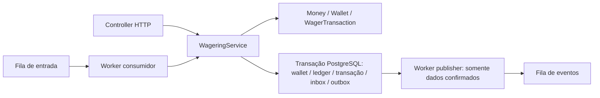
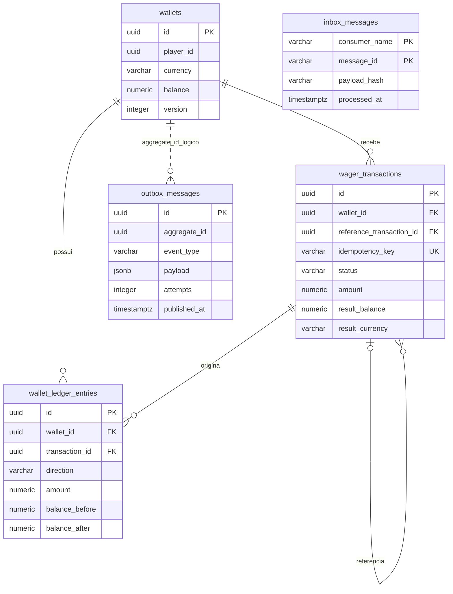

# Arquitetura e decisões

Este documento descreve o código atual e distingue requisitos explícitos de interpretações e decisões técnicas.

Fonte de requisitos: [desafio oficial](https://github.com/junglegaming/backend-challenge). Referências às seções abaixo distinguem obrigação, interpretação e decisão técnica. Recursos de ordenação FIFO não são a garantia financeira.

## Responsabilidades e módulos

Controllers recebem dados HTTP, validam parâmetros de rota e o header e escolhem o status da resposta. Services coordenam domínio e persistência. As classes Money, Wallet, WagerTransaction, WalletLedgerEntry, InboxMessage, OutboxMessage e IntegrationEvent não dependem de NestJS ou TypeORM. Entidades de persistência mapeiam colunas e ficam separadas dessas classes.

WalletModule reúne abertura, leitura, ledger e reconciliação. WageringModule reúne submissão e consultas de transações. MessagingModule importa WageringModule e coordena consumidor, publisher e referências pendentes. HealthController expõe verificações públicas e métricas.

**Decisão técnica:** manter poucos services, sem repository ports ou camadas genéricas adicionais. DataSource e EntityManager do TypeORM delimitam o SQL. O service de wagering concentra uma coordenação extensa; separar aplicação/persistência pode ser uma evolução quando houver benefício concreto.

**Escolha de ORM:** TypeORM é aceito pela especificação e já organiza o projeto. DataSource.transaction, EntityManager e locks de linha atendem à atomicidade e concorrência necessárias. Manter a ferramenta evita uma migração para MikroORM sem ganho demonstrado para este escopo. MikroORM seria alternativa válida, com Unit of Work explícita; repository ports poderiam isolar a persistência, ao custo de mais contratos e arquivos. O domínio permanece independente do ORM.

## Money

**Requisito, seção 6.1:** strings decimais de duas casas, aritmética exata, conflitos de moeda, imutabilidade e independência de ORM/framework.

Money.from valida estrutura monetária e rejeita negativos de entrada, notação científica e precisão excessiva. add/subtract/negate retornam novas instâncias, podendo produzir negativos internos. Isso permite expressar uma diferença de reconciliação negativa sem aceitar débitos negativos na API.

**Decisões:** Decimal.js com clone de precisão 40; magnitude inferior a `10^18`, igual à capacidade de 18 dígitos inteiros do schema `numeric(20,2)`. Só há soma/subtração de valores de escala 2: não arredondamos entradas com mais casas. O domínio rejeita overflow antes de persistir. A lista `Intl.supportedValuesOf('currency')` do ICU valida códigos suportados; BRL e USD são usados nos testes. Essa lista depende da versão do runtime e não é uma tabela ISO mantida pelo projeto.

Alternativa: centavos inteiros em bigint. Seria exata, mas Decimal.js segue o modelo de referência e mantém a representação decimal explícita. Não há conversão de dinheiro para number; números são usados apenas em versões, contadores, métricas e intervalos.

**Interpretação aprovada:** BET precisa ser estritamente positiva. Money continua permitindo zero para saldos e LOSS.

**Interpretação aprovada pelo candidato:** WIN também precisa ser estritamente positiva. A documentação não proíbe explicitamente WIN zero, mas prevê um CREDIT por WIN e correspondência entre ledger e alteração de saldo. Escolhemos rejeitar zero para preservar esse fluxo sem criar lançamentos sem movimentação. A alternativa seria aceitar WIN zero e definir uma exceção para seu ledger; não foi adotada. O service valida essa regra no mesmo ponto de entrada utilizado por HTTP e SQS, antes de acessar o banco. HTTP retorna 400 com mensagem específica; não persiste uma transação REJECTED, pois trata o valor como contrato de entrada inválido. Money continua aceitando zero, pois a regra depende do tipo da operação. Testes verificam rejeição de zero, aceitação de 0.01 e 25.00 e preservação de LOSS zero.

**Como explicar isso na entrevista:** “A especificação não detalha prêmio zero. Documentamos nossa interpretação: BET e WIN exigem valores positivos. A validação fica no service para valer tanto na API quanto na fila; Money cuida da representação monetária e permite zero para outros usos.”

## Contrato de entrada

DTO é interface e desaparece em execução. O header HTTP opcional X-Correlation-Id é repassado ao service e aos eventos; deve ser não vazio e ter até 255 caracteres, conforme a coluna de persistência. Sem ele, a transação fornece o identificador de correlação. Esse header é metadado de diagnóstico, não chave de idempotência. O service valida kind, identificadores, UUIDs, money e referências. OPENING nunca é aceito externamente. REFUND e ROLLBACK exigem referência não vazia.

**Decisões de representação:** UUIDs de versões 1 a 8 para player/wallet; limites dos identificadores derivados das colunas existentes: provider 100, externalTransactionId 150, round/game 255 e chave 255 caracteres. A referência também limita a 150 por apontar para um identificador externo. Não fazemos trim ou normalização textual antes do hash; trim apenas identifica strings vazias. **Correção de identidade:** comparações de playerId e walletId ignoram maiúsculas/minúsculas, pois UUIDs equivalentes representam a mesma identidade e PostgreSQL os retorna em minúsculas. Isso não muda a política de hash do texto recebido. A contagem de varchar considera pontos de código Unicode.

Uma referência não informada quando obrigatória resulta em 400. Uma referência informada e não encontrada produz PENDING_REFERENCE persistida.

## Fluxo financeiro e concorrência

1. Validar a entrada e calcular hash de negócio.
2. Abrir transação SQL e selecionar a wallet com `FOR UPDATE`.
3. Registrar/conferir inbox se a entrada for SQS.
4. Tentar inserir a transação, protegida pelos índices únicos.
5. Em duplicidade, conferir chave e hash e retornar o resultado persistido.
6. Em operação nova, resolver referência e aplicar regras de domínio.
7. Persistir saldo e ledger quando houver movimentação, resultado/status e eventos na outbox.
8. Commit; só depois responder ao HTTP ou confirmar a mensagem SQS.

**Requisito, seções 5, 8 e 11:** evitar lost update, garantir múltiplas instâncias e atomicidade. **Decisão técnica:** pessimistic locking na linha da wallet sob isolamento padrão READ COMMITTED. Wallets distintas não compartilham lock. A versão inicia em 1 e só aumenta ao aplicar uma movimentação positiva; LOSS, rejeições e replay não incrementam.

O lock deve anteceder a leitura usada para decidir saldo. Os mesmos EntityManager e conexão transacional gravam todas as partes. Se uma gravação de outbox falhar, a wallet, a transação, o ledger e a inbox são revertidos. A rejeição de negócio é persistida e confirmada; não lançamos exceção dentro do SQL para uma rejeição esperada.

Alternativas: optimistic locking exigiria retries e versão condicionada; update atômico condicionado é adequado para saldo, mas não coordena sozinho referências, ledger e eventos. Escolhemos a abordagem mais direta para explicar e testar essas garantias.

## Idempotência

**Requisito, seção 9:** chave obrigatória e fonte da verdade, JSON canônico de campos de negócio, conflito de payload e replay com saldo original.

**Decisão:** SHA-256 em UTF-8 de JSON com chaves ordenadas recursivamente. Entram providerId, externalTransactionId, playerId, walletId, roundId, gameId, kind, money.amount, money.currency e referência se presente. Header, correlationId e campos extras não entram. Não normalizamos o texto de amount antes do hash: textos diferentes podem produzir conflito mesmo quando têm valor numérico equivalente.

Há unicidade global de idempotency_key e de `(provider_id, external_transaction_id)`. INSERT ON CONFLICT DO NOTHING evita deixar o SQL abortado ao encontrar duplicidade; depois lemos os registros envolvidos. A mesma identificação externa com chave diferente é conflito, para preservar uma identidade única sem gerar outra operação. Se chave e identificação apontarem para registros diferentes, também é conflito.

Persistimos result_balance e result_currency: o replay não usa o saldo atual da wallet. Pendências podem avançar de estado pelo worker; sua consulta/replay passa a refletir o resultado mais recente. Resultados terminais permanecem terminais.

## Regras e referências

BET debita com verificação de saldo. WIN credita. LOSS registra processamento sem ledger. REFUND reverte uma BET processada. ROLLBACK inverte BET, WIN ou REFUND processada. O domínio verifica mesma identidade de provider, player, wallet, moeda e rodada; gameId não é adicionado como restrição de referência.

Reversões exigem valor completo igual ao da referência. Reversões processadas do mesmo tipo não se repetem. O índice único parcial permite registrar tentativas rejeitadas. A restrição é por tipo: não inventamos uma exclusão mútua entre REFUND e ROLLBACK. Isso permite, por exemplo, um REFUND e um ROLLBACK da mesma BET, cada um uma vez, como a regra por tipo descreve. Não exigimos gameId igual ao da referência.

**Interpretação necessária:** se WIN fornece uma referência opcional, ela é validada como BET; enquanto ausente ou pendente, a operação aguarda. Outros campos de referência fornecidos também são resolvidos e conferidos quanto ao contexto; não adicionamos uma proibição de campos não explicitada no contrato.

PENDING_REFERENCE é revisitada por um loop com pausa de 500 ms após cada ciclo, com datas de tentativa persistidas e lock por wallet. A seleção pode se repetir entre instâncias; depois do lock, o status e a data são conferidos novamente. A pendência nasce com primeira tentativa em 1 segundo; falhas de resolução aumentam o backoff até 5 minutos. Após 10 tentativas de espera, a próxima visita rejeita se a referência continua inexistente (REFERENCE_NOT_FOUND) ou pendente (REFERENCE_NOT_PROCESSED). Se a referência já se tornou aplicável, ela ainda é processada normalmente; uma referência terminal rejeitada/falhada é rejeitada sem aguardar esse limite. O limite é uma decisão operacional para o desafio local, não SLA de produção; merece configuração e ajuste com métricas em uma operação real.

## Estados e códigos de falha

Transições: PENDING → PENDING_REFERENCE, PROCESSED, REJECTED ou FAILED; PENDING_REFERENCE → PROCESSED, REJECTED ou FAILED. Os estados finais não aceitam novas transições no domínio; tentativas lançam InvalidTransactionStateError, erro de programação.

| Código                           | Significado                                                        |
| -------------------------------- | ------------------------------------------------------------------ |
| INSUFFICIENT_FUNDS               | BET sem saldo                                                      |
| REVERSAL_WOULD_OVERDRAW          | Reversão debitaria mais que o saldo                                |
| PLAYER_MISMATCH                  | Jogador da operação difere do da wallet                            |
| CURRENCY_MISMATCH                | Moeda da operação difere da wallet                                 |
| REFERENCE_MISMATCH               | Referência em contexto diferente                                   |
| INVALID_REFERENCE_KIND           | Referência tem tipo incompatível                                   |
| REFERENCE_NOT_PROCESSED          | Referência rejeitada/falhada, ou espera esgotada sem processamento |
| REFERENCE_NOT_FOUND              | Limite de espera esgotado sem referência                           |
| REVERSAL_AMOUNT_MISMATCH         | Valor de reversão difere da referência                             |
| ALREADY_REVERSED                 | Mesmo tipo já reverteu essa referência                             |
| MONEY_LIMIT_EXCEEDED             | Resultado monetário excederia o limite técnico                     |
| PERMANENT_INFRASTRUCTURE_FAILURE | Tentativas de infraestrutura esgotadas, com FAILED auditável       |

Esses nomes são decisão nossa. A distinção entre insuficiência em BET e em reversão é requisito explícito. Rejeições não produzem ledger. **Decisão adicional:** WagerTransactionFailed é um evento além dos quatro mínimos oficiais, emitido quando FAILED é persistido, para comunicar a falha auditável sem confundi-la com rejeição de negócio. FAILED pode ser registrado pelo consumidor ao esgotar retries, sem movimentação. Se o banco ainda estiver inacessível, não há como gravar esse estado; a mensagem permanece recuperável pela fila/DLQ e exige reenvio quando a infraestrutura voltar.

## Schema e migrations

As entidades armazenam amount/currency em colunas separadas; NUMERIC(20,2) é lido como string, sem transformer para number. O service reidrata Money e as classes de domínio, aplica transições e grava o resultado pelo mesmo EntityManager.

A relação da outbox com a wallet é lógica: aggregate_id não possui foreign key. Inbox não possui FK para uma transação financeira. A associação com o efeito é garantida pela transação SQL do caso de uso, não por uma relação ORM.

Cinco migrations versionadas têm up/down.

| Migration                                                                                     | Responsabilidade                                                             |
| --------------------------------------------------------------------------------------------- | ---------------------------------------------------------------------------- |
| [CreateWallets](./src/database/migrations/1791394200000-CreateWallets.ts)                     | Wallet, unicidade player/moeda, saldo não negativo e versão válida           |
| [CreateWageringAndLedger](./src/database/migrations/1791399591333-CreateWageringAndLedger.ts) | Transações, ledger, unicidades, FKs, aritmética e trigger de imutabilidade   |
| [AddWagerResultBalance](./src/database/migrations/1791399700000-AddWagerResultBalance.ts)     | Saldo histórico do resultado                                                 |
| [CreateInboxOutbox](./src/database/migrations/1791400000000-CreateInboxOutbox.ts)             | Inbox/outbox, reversão única por tipo e índices de leitura/seleção           |
| [AddProcessingState](./src/database/migrations/1791400100000-AddProcessingState.ts)           | Moeda/correlação do resultado, agendamento, checks de estado/tipo e backfill |

`synchronize: false` evita alterações automáticas. Migrations são a fonte do schema, inclusive triggers e índices parciais que não estão todos nos decorators.

Os índices do ledger (wallet_id, created_at, id), outbox pendente e referências pendentes apoiam os caminhos de consulta dos workers; o índice parcial de reversão também impõe uma regra de unicidade.

Garantias já no banco: wallet única por jogador/moeda; saldo e versão não negativos/inválidos; chaves financeiras únicas; ledger único por wallet/transação; valores positivos do ledger; saldos antes/depois não negativos; direção válida; aritmética correta; foreign keys para wallet, transação e referência; trigger bloqueando UPDATE, DELETE e TRUNCATE do ledger; inbox composta; outbox com tentativas não negativas; reversões processadas únicas por tipo; kind/status válidos e referência interna obrigatória em reversão processada.

A última migration acrescenta moeda do resultado, correlação e agendamento de referências; result_balance foi criado pela terceira migration. Ela também preenche resultados de transações antigas que já possuem ledger, usando balance_after, para que OPENINGs anteriores possam ser consultadas corretamente. Esses dados permitem replay correto e recuperação de espera após reinício. Down remove estrutura/dados: reversível significa recuperar o schema anterior, não preservar dados apagados. Não aplicamos migrations automaticamente no bootstrap. A igualdade agregada entre saldo e soma do ledger é mantida pelo caso de uso transacional e conferida por reconciliação/testes; não existe trigger que recalcula o saldo da wallet ou verifica essa soma a cada INSERT. As constraints do ledger verificam cada lançamento individual.

## SQS, inbox e outbox

Filas de entrada e DLQ seguem os nomes oficiais. **Decisão:** publicar os eventos em `wager-events.fifo`, separado da entrada para evitar consumo financeiro dos próprios eventos. LocalStack é iniciado por Compose. Credenciais `test` destinam-se ao ambiente local.

O consumidor verifica primeiro se o envelope é um objeto não nulo e não é um array; depois valida seus campos e o payload e chama o service compartilhado. JSON sintaticamente válido como null, array, string ou número é erro permanente de entrada, enviado à DLQ na primeira tentativa. A inbox deduplica por consumidor/messageId; seu hash é SHA-256 do corpo bruto recebido, detectando reutilização do mesmo messageId com outra representação. A idempotência financeira é independente desse hash e usa o JSON canônico. A inbox marca conclusão também para aceite pendente: o worker de referência assume a continuação.

Negócio terminal é confirmado após commit. Payload inválido vai para DLQ. Infraestrutura transitória usa visibilidade com backoff de 2^receiveCount, teto 30 segundos e limite 5. O Compose também configura redrive nativo. No caminho manual, a DLQ guarda originalBody e sourceMessageId; no redrive nativo, o SQS preserva o body original sem esse wrapper; no caminho manual, o ack só ocorre após envio à DLQ. Ao esgotar tentativas válidas, o consumidor procura registrar FAILED e seu evento; resultados já terminais não são alterados.

A inbox tem consumerName/messageId único e hash do corpo bruto. No caminho financeiro atual, o service usa InboxMessageEntity diretamente: confere hash e, junto com a idempotência financeira, impede efeitos repetidos. O processedAt é gravado ao concluir esse SQL e pode ser atualizado em um replay; a classe InboxMessage representa o estado e é testada, mas seus métodos não são chamados nesse caminho. Não afirmamos que há short-circuit por isProcessed(): a redelivery passa novamente pela conferência financeira.

O publisher seleciona um registro de outbox por transação, com FOR UPDATE SKIP LOCKED. Mantém o lock da linha da outbox durante o envio ao SQS e marca published_at; em falha, persiste attempts/next_attempt_at. Essa escolha simplifica a coordenação de publishers, mas ocupa conexão/transação durante I/O. Uma alternativa seria claim com lease persistente, exigindo recuperação e expiração adicional. O backoff da outbox vai de 1 segundo a 5 minutos, sem abandonar um evento confirmado. A publicação só enxerga dados financeiros já confirmados, apesar de usar sua própria transação SQL.

Se o envio ocorreu e o processo morreu antes de marcar published_at, o evento pode ser publicado novamente com o mesmo eventId. **Garantia: at-least-once, não exactly-once.** Consumidores externos devem deduplicar por eventId. FIFO dedup não substitui essa obrigação. A integração mata um publisher real com SIGKILL após SendMessage e antes da marcação/commit, confirma que outra instância retoma o registro e mantém eventId. Um consumidor demonstrativo **somente no teste** grava inbox por consumerName/eventId e um contador de efeitos na mesma transação SQL, e confirma o ack após commit. Depois de reconectar ao PostgreSQL, recebe uma cópia real do mesmo evento e aplica apenas um efeito. Para não depender da janela de deduplicação FIFO, o teste força a cópia com um MessageDeduplicationId de transporte diferente. Não existe consumidor de negócio externo em execução na API; o teste demonstra o contrato de integração.

Em SIGTERM, beforeApplicationShutdown impede novos ciclos e aguarda os ciclos em andamento antes de fechar o cliente SQS e o banco. O receive usa long polling de 2 segundos; o SDK tem timeout de 5 segundos e duas tentativas. Falhas transitórias de banco/fila não encerram os loops. Não há heartbeat de visibilidade: a mensagem pode voltar se uma operação exceder 30 segundos, permanecendo protegida pela inbox/idempotência. Aumentar duração e adicionar extensão de visibilidade seria melhoria operacional.

## Eventos de integração

Todas as subclasses têm version 1. O envelope contém eventId, eventType, version, aggregateId (walletId), correlationId, occurredAt em ISO-8601 e data; causationId é opcional e a entrada SQS o preenche com messageId. Valores monetários no data são MoneyProps, nunca instâncias de Money. O publisher usa aggregateId como MessageGroupId e eventId como MessageDeduplicationId.

| Evento                           | Quando é persistido                      | Dados específicos além da identificação da transação          |
| -------------------------------- | ---------------------------------------- | ------------------------------------------------------------- |
| WagerTransactionProcessed        | Processamento, inclusive LOSS e OPENING  | money e balance                                               |
| WagerTransactionRejected         | Rejeição de negócio                      | money e failureCode                                           |
| WagerTransactionPendingReference | Aceite aguardando referência             | money e referenceExternalTransactionId                        |
| WalletBalanceChanged             | Existe lançamento com alteração de saldo | direction, money, balanceBefore, balanceAfter e walletVersion |
| WagerTransactionFailed           | FAILED auditável; decisão adicional      | money e failureCode                                           |

Os eventos WagerTransaction* incluem transactionId, walletId, providerId, externalTransactionId, kind e money. WalletBalanceChanged possui walletId/transactionId e os campos de movimentação listados na tabela, sem os demais campos do provedor.

Os quatro eventos da especificação são obrigatórios; Failed é uma extensão documentada. Em uma operação com saldo alterado, Processed e BalanceChanged têm eventIds diferentes e a mesma correlação. O paralelismo de publishers e seus retries não garante a ordem de entrega desses eventos, mesmo usando um grupo por wallet. O consumidor deve tratar duplicatas e não depender de uma ordem global.

## Consultas, cursor e reconciliação

O ledger é ordenado por created_at/id. Cursor opaco é base64url de walletId, timestamp completo e UUID. A próxima página usa comparação de tupla, sem offset, e retorna nextCursor ou null. Preservamos a precisão do timestamp do banco. O cursor não é credencial, não é assinado e não é um snapshot de todas as páginas. O limit padrão é 50, com máximo 100 como decisão de proteção de consultas.

Reconciliação usa REPEATABLE READ para que saldo e soma dos lançamentos pertençam ao mesmo snapshot. Soma CREDIT menos DEBIT no PostgreSQL exato, compara com Money e retorna storedBalance, calculatedBalance, difference (armazenado menos calculado), consistent e checkedEntries. Divergências geram log e métrica e não são corrigidas automaticamente.

## Observabilidade e HTTP

O bootstrap usa ConsoleLogger JSON. Logs de operação incluem identificação, correlação, status e replay, sem amount ou payload financeiro completo. Workers registram identificação e classe de erro, evitando mensagens de SQL que poderiam conter dados. O filtro HTTP mantém erros conhecidos e mapeia falhas transitórias reconhecidas para 503 em todos os controllers.

Liveness não consulta dependências. Readiness verifica PostgreSQL e SQS. `/metrics` expõe contadores de status, duplicatas, retries, DLQ, conflitos de lock, divergências de reconciliação, soma/contagem de latência e gauge de outbox lag. **Decisão:** no reprocessamento, contadores de status e retries só são atualizados depois que a transação SQL resolve com commit. Uma constraint trigger diferida injetada no teste comprova que falha no commit não conta processamento nem muda saldo/ledger. Os contadores de status representam resultados/transições observados, não um inventário do estado atual no banco.

`wager_dlq_total` conta encaminhamentos manuais concluídos pelo worker. `wager_dlq_messages` é um gauge aproximado consultado no SQS (visíveis, em processamento e atrasadas), atualizado pelo loop e cobrindo também redrive nativo. O teste confirma redrive sem incremento do contador manual e aumento do gauge. Atributos SQS são aproximados e podem demorar a refletir alterações. Com WORKERS_ENABLED=false o gauge não é atualizado.

São métricas por processo, reiniciadas com ele; a memória não participa das garantias financeiras. Dashboard/OpenTelemetry não foram implementados.

O mapeamento abaixo é da submissão HTTP e seus replays; GETs de recursos existentes retornam 200 e expõem o status financeiro no body.

Status: payload 400; recurso inexistente 404; conflito 409; rejeição financeira 422; pendência 202; processado/replay 200; infraestrutura transitória 503; FAILED no replay ou erro inesperado 500. A criação de wallet usa 201.

## Autenticação adiada

**Decisão aprovada pelo candidato:** priorizar correção financeira. ProviderAuthGuard é no-op e permite todas as requisições; não oferece proteção. Uma implementação futura validaria tokens OIDC de IdP externo (assinatura, emissor e audiência) e a identidade autorizada do provider. Não criaríamos banco próprio de senhas. Health permanece público; mensagens de fila são canal interno, preservando validações de domínio.

## Limites operacionais

- Compose executa dependências, enquanto a API roda localmente em Bun. PostgreSQL usa volume; LocalStack não usa persistência configurada. Restart da aplicação é coberto pelos testes, mas recriar o broker não representa durabilidade de uma implantação AWS real.
- Não há lock_timeout ou statement_timeout configurado pela aplicação. Shutdown aguarda SQL em andamento e não tem prazo máximo próprio; os timeouts do SDK SQS não limitam a espera no banco.
- Não há endpoint de reenvio de DLQ ou retenção/limpeza de inbox, outbox e ledger. Uma operação manual precisa preservar os identificadores e considerar que FAILED é terminal; reenviar a mesma operação terminal não a reaplica.
- O backfill recupera resultados antigos com ledger. Uma transação legada sem result_balance e sem ledger não ganha saldo histórico por inferência; toResponse não oferece fallback para esse caso. O fluxo atual persiste o resultado de todas as novas submissões.

## Verificação e limites

Bun é o runtime da API e o runner dos testes. Controllers/services usam @Inject explícito: o transpiler de desenvolvimento/testes não precisa inferir metadata de tipos para resolver esses construtores. O build TypeScript continua emitindo metadata. Nos testes, a regra await-thenable do lint é desligada devido à tipagem dos matchers assíncronos do Bun; verificações de promises na aplicação continuam ativas.

As suítes reais também verificam o bootstrap da aplicação compilada em Bun e encerramento com SIGTERM. Elas verificam migrations reversíveis e constraints, atomicidade com falha injetada na outbox, 50 repetições paralelas, disputa de saldo, três processos Bun, wallets distintas, referências tardias e esgotadas, inbox/redelivery, publishers simultâneos, retry/DLQ, processo morto após commit/antes do ack, reinício e fluxo HTTP completo. Testes unitários verificam Money, Wallet, transições terminais, referências (contexto, moeda, tipo, estado e reversão integral), hash, conflito de idempotência no service e validação. Toda suíte de integração executa uma conferência independente após cada teste: soma SQL exata de CREDIT menos DEBIT deve igualar o saldo de cada wallet no banco isolado, inclusive nos cenários de rejeição, conflito e falha. Fixtures de schema também preservam essa igualdade. Não foram feitos testes de carga ou de falha do host Docker.

Pendências operacionais: autenticação real, consumidor externo de negócio (a deduplicação é demonstrada em teste) e métricas distribuídas. Nenhuma dessas capacidades deve ser inferida da existência das classes ou filas.

## Como explicar cada bloco na entrevista

**Financeiro:** “Bloqueio a wallet no banco antes de decidir se há saldo. Uso o mesmo transaction manager para saldo, ledger, transação, inbox e outbox. Uma falha reverte tudo; uma rejeição esperada é registrada e confirmada para ser auditável.”

**Idempotência:** “A chave e os identificadores têm constraints. O hash é canônico e cobre só negócio. No replay devolvo o resultado persistido, inclusive o saldo histórico, sem aplicar a operação novamente.”

**Consultas:** “O cursor usa timestamp e UUID para continuar uma ordenação estável sem offset. A reconciliação lê saldo e ledger no mesmo snapshot e sinaliza divergências em vez de escondê-las.”

**Mensageria:** “Ack só acontece depois do commit. Se o worker morrer nesse intervalo, a redelivery encontra inbox/idempotência persistentes. Se morrer antes de publicar um evento confirmado, outro publisher o encontra na outbox. Uma duplicata de evento mantém o mesmo eventId.”

**Falhas e observabilidade:** “Erros de negócio são terminais e têm códigos estáveis. Falhas transitórias recebem retry limitado; mensagens problemáticas ficam na DLQ. Health e métricas ajudam a distinguir processo vivo de dependências disponíveis.”

Perguntas para praticar: por que version não basta para evitar uma race? Por que o ledger é imutável também no banco? Por que capturar uma unique violation dentro do SQL pode abortar a transação? O que acontece se uma chave apontar para uma operação e o identificador externo para outra? Por que publicar duas vezes pode ser inevitável? Por que a reconciliação precisa de um snapshot consistente?

## Fechamento da auditoria: como explicar na entrevista

**Identidade e entrada:** “A referência compara UUIDs como identidades, sem diferenciar a caixa das letras. JSON válido não garante um envelope válido: null e arrays são rejeitados antes do acesso aos campos.”

**Testes financeiros:** “Após cada cenário, reconstruo o saldo por SQL exato e comparo com o materializado. Não uso apenas o endpoint que estou testando como prova da consistência.”

**Duplicatas de publicação:** “Mato o publisher depois do envio e antes de confirmar a outbox. Outro processo pode repetir o envio com o mesmo eventId. O consumidor demonstrativo confirma inbox e efeito juntos; a duplicata não repete o efeito, mesmo após reconexão.”

**Observabilidade:** “Só conto a transição da referência após commit. Distingo o total de envios manuais à DLQ da quantidade aproximada atual na fila, que inclui o redrive do broker. A correlação acompanha a requisição e seus eventos, mas não participa da idempotência.”

Perguntas: por que a deduplicação FIFO não basta? O que acontece se o consumidor morrer entre efeito e ack? Por que a inbox deve estar no mesmo SQL do efeito? Por que um contador não representa o tamanho atual da DLQ? Por que uma métrica não é a fonte de verdade financeira?
